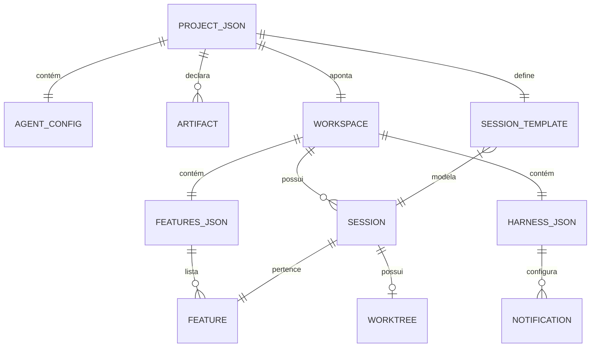

# Swarm Factory — Modelo de Dados (Runs v2)

Schemas JSON que definem a estrutura de dados do módulo Runs. Não há banco de dados — os dados vivem em arquivos JSON no filesystem.

---

## Diagrama de Relacionamentos



---

## Entidades Detalhadas

### project.json

Manifesto do projeto — vive no Runs (`runs/`). Fonte da verdade para orquestração.

| Campo | Tipo | Descrição |
|-------|------|-----------|
| version | integer | Versão do schema — define quais artefatos existem |
| slug | string | Identificador machine-friendly (chave para APIs, dashboards, logs) |
| name | string | Nome humano do projeto |
| description | string \| null | Contexto sobre o projeto |
| specs | string | Caminho para specs/PRPs/refs (relativo ao workspace ou absoluto) |
| workspace | string | Caminho absoluto para o diretório de desenvolvimento |
| agent | AgentConfig | Configuração do agente |
| artifacts | Record\<string, Artifact\> | Artefatos declarados com tipo e path |

### agent (AgentConfig)

Configuração de comportamento do agente dentro do `project.json`.

| Campo | Tipo | Descrição |
|-------|------|-----------|
| harness | string | Agente a usar (`claude-code`, `opencode`, `codex`) |
| model | string \| null | Modelo do agente (null = default) |
| max_turns | integer \| null | Turns por sessão (null = sem limite) |
| max_iterations | integer \| null | Iterações totais do loop (null = sem limite) |
| max_features | integer \| null | Features a completar (null = sem limite, 1 = manual) |
| max_retries | integer | Tentativas por feature antes de rotação/skip (default: 5) |

### artifact

Declaração de artefato no `project.json`.

| Campo | Tipo | Descrição |
|-------|------|-----------|
| type | string | `file` ou `dir` |
| path | string | Caminho relativo ao workspace ou absoluto |

### session_template

Template que define a estrutura de cada sessão de feature.

| Campo | Tipo | Descrição |
|-------|------|-----------|
| pattern | string | Padrão de path (ex: `./.sessions/{feature-id}/`) |
| files | string[] | Arquivos criados por sessão |
| dirs | string[] | Diretórios criados por sessão |

Arquivos padrão (v1):

| Arquivo | Descrição |
|---------|-----------|
| checklist.md | Checklist da feature derivado dos critérios |
| output.jsonl | Log completo da sessão do agente |
| pid | PID do processo do agente |
| started_at | Timestamp de início |
| finished_at | Timestamp de conclusão |

Diretórios padrão (v1):

| Diretório | Descrição |
|-----------|-----------|
| worktree | Git worktree isolado da feature (futuro) |

---

### agent-harness.json

Versão resolvida do config — vive no workspace destino. Torna o workspace autônomo.

| Campo | Tipo | Descrição |
|-------|------|-----------|
| version | integer | Versão do schema que gerou este arquivo |
| slug | string | Slug do projeto |
| name | string | Nome do projeto |
| specs | string | Caminho absoluto resolvido para specs |
| workspace | string | Caminho absoluto do workspace |
| agent | AgentConfig | Configuração do agente (mesma estrutura) |
| artifacts | Record\<string, string\> | Paths absolutos resolvidos de cada artefato |
| notifications | Notification[] | Webhooks configurados (opcional) |

### notification

Configuração de webhook no `agent-harness.json`.

| Campo | Tipo | Descrição |
|-------|------|-----------|
| url | string | Endpoint do webhook |
| events | string[] | Eventos que disparam (`completed`, `stopped`, `error`, `*`) |

---

### features.json

Tracking de features — vive no workspace. Gerenciado pelo loop.

| Campo | Tipo | Descrição |
|-------|------|-----------|
| (raiz) | Feature[] | Array de features |

### feature

Uma feature individual no `features.json`.

| Campo | Tipo | Descrição |
|-------|------|-----------|
| id | string | Identificador da feature (ex: `F-001`) |
| title | string | Título descritivo |
| description | string | Descrição detalhada / critérios |
| status | FeatureStatus | Estado atual |
| priority | integer | Prioridade (maior = mais prioritário) |
| dependencies | string[] | IDs de features que devem estar `passing` antes |
| retries | integer | Contagem de tentativas (incrementada pelo loop) |
| prp_ids | string[] | IDs dos PRPs de origem |

---

## Enums

```typescript
// Status de feature — ciclo de vida completo
type FeatureStatus =
  | 'pending'       // Aguardando — ainda não foi pega
  | 'in_progress'   // Em execução — agente trabalhando (previne concorrência)
  | 'failing'       // Falhando — testes não passaram na última tentativa
  | 'blocked'       // Bloqueada — dependências não satisfeitas (computado)
  | 'skipped'       // Pulada — gutter detection após falhas consecutivas
  | 'passing'       // Passando — testes OK, feature completa

// Eventos de webhook
type WebhookEvent =
  | 'completed'     // Loop terminou (todas as features ou max atingido)
  | 'stopped'       // Graceful stop via .stop file
  | 'error'         // Erro não tratado no loop
  | 'feature_done'  // Uma feature completou (passing)
  | 'feature_skip'  // Uma feature foi pulada (skipped)
  | '*'             // Todos os eventos

// Harnesses suportados
type Harness =
  | 'claude-code'
  | 'opencode'
  | 'codex'
```

---

## Artefatos por Versão

### Versão 1

| Chave | Tipo | Path Padrão | Descrição |
|-------|------|-------------|-----------|
| harness_config | file | `./agent-harness.json` | Config resolvida do workspace |
| harness_script | file | `./agent-harness.mjs` | Script do loop |
| setup_script | file | `./agent-setup.mjs` | Script de setup inicial |
| features | file | `./features.json` | Tracking de features |
| progress | file | `./agent-progress.txt` | Log textual |
| state | file | `./agent-harness.state` | Estado do loop (runtime) |
| pid | file | `./agent-harness.pid` | PID do loop (runtime) |
| sessions | dir | `./.sessions` | Diretório de sessões |
| current_milestone | file | `./.sessions/.current-milestone` | Milestone ativo |

---

## Formatos de project.json no Filesystem

| Formato | Path | Uso |
|---------|------|-----|
| Flat | `runs/{project}_{milestone}.json` | Projetos avulsos, criação manual rápida |
| Structured | `runs/{project}/{milestone}/project.json` | Padrão, escolha do `/run:create` |

Ambos produzem o mesmo objeto em memória após `load-project.mjs`.

---

## Relacionamentos Principais

1. **project.json → workspace**: 1:1 — cada projeto aponta para exatamente um workspace
2. **project.json → artifacts**: 1:N — um projeto declara múltiplos artefatos
3. **project.json → agent config**: 1:1 — configuração embarcada
4. **workspace → features.json**: 1:1 — um arquivo de tracking por workspace
5. **features.json → features**: 1:N — lista de features
6. **workspace → sessions**: 1:N — uma sessão por feature executada
7. **session → worktree**: 1:0..1 — worktree opcional por sessão (futuro)
8. **agent-harness.json → notifications**: 1:N — array de webhooks configurados

---

## Rastreabilidade

| Entidade | Requisitos |
|----------|------------|
| project.json | OSD020–OSD031 |
| AgentConfig | OSD130, OSD131, OSD093–OSD096 |
| artifact | OSD025, OSD026, OSD097–OSD100 |
| session_template | OSD100, OSD170, OSD171 |
| agent-harness.json | OSD090, OSD091, RNF007 |
| notification | OSD150–OSD155 |
| features.json / feature | OSD126–OSD131 |
| FeatureStatus | OSD126–OSD129 |
| Formatos de filesystem | OSD028, OSD029 |
