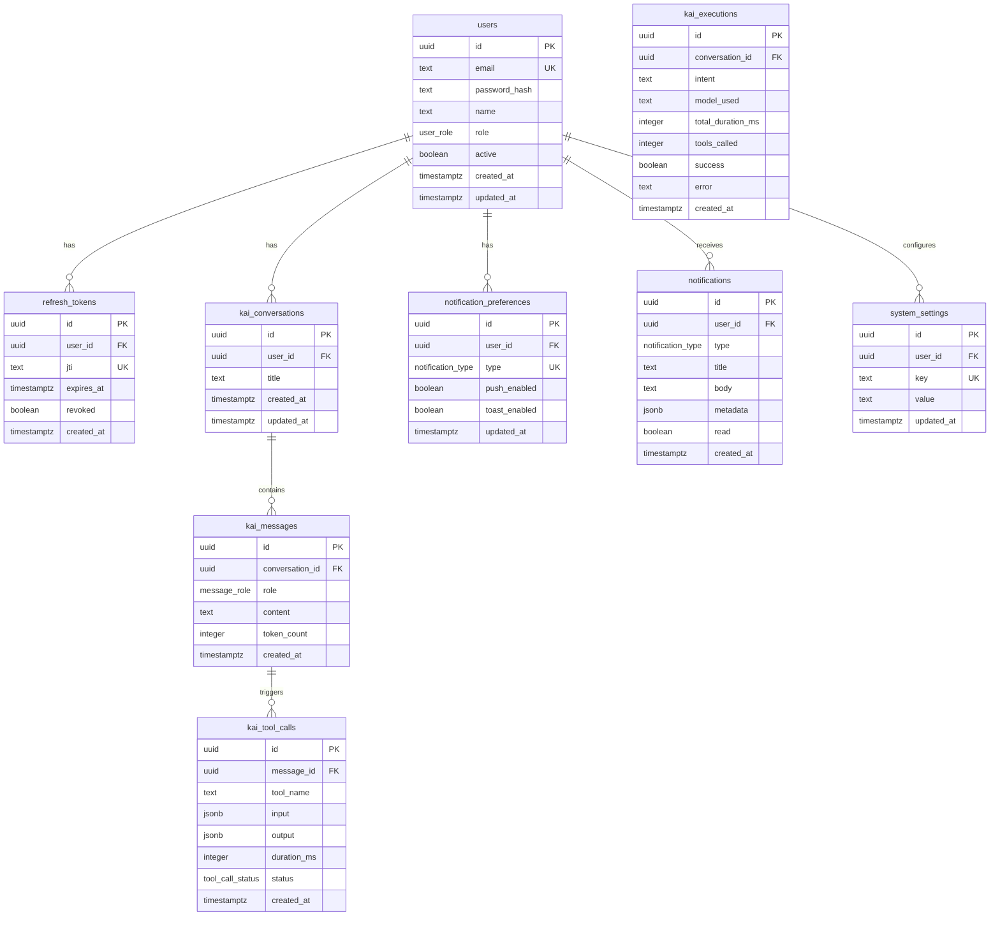

# E-Kai - Modelo de Dados (ER)

Modelo de dados do app de gestao PWA com copilot agentico Kai.

---

## Diagrama Entidade-Relacionamento



---

## Entidades Detalhadas

### users

Usuarios do sistema de gestao.

| Campo | Tipo | Descricao |
|-------|------|-----------|
| id | uuid | PK, gen_random_uuid() |
| email | text | Unique, email do usuario |
| password_hash | text | Hash bcrypt da senha |
| name | text | Nome de exibicao |
| role | user_role | Perfil de acesso |
| active | boolean | Ativo no sistema, default true |
| created_at | timestamptz | Data de criacao |
| updated_at | timestamptz | Ultima atualizacao (trigger) |

---

### refresh_tokens

Tokens de refresh para autenticacao JWT.

| Campo | Tipo | Descricao |
|-------|------|-----------|
| id | uuid | PK, gen_random_uuid() |
| user_id | uuid | FK para users(id) ON DELETE CASCADE |
| jti | text | Unique, JWT ID para invalidacao |
| expires_at | timestamptz | Expiracao do token |
| revoked | boolean | Token revogado, default false |
| created_at | timestamptz | Data de criacao |

---

### kai_conversations

Conversas entre operador e Kai.

| Campo | Tipo | Descricao |
|-------|------|-----------|
| id | uuid | PK, gen_random_uuid() |
| user_id | uuid | FK para users(id) ON DELETE CASCADE |
| title | text | Titulo auto-gerado ou definido pelo usuario |
| created_at | timestamptz | Data de criacao |
| updated_at | timestamptz | Ultima mensagem (trigger) |

---

### kai_messages

Mensagens individuais em uma conversa com a Kai.

| Campo | Tipo | Descricao |
|-------|------|-----------|
| id | uuid | PK, gen_random_uuid() |
| conversation_id | uuid | FK para kai_conversations(id) ON DELETE CASCADE |
| role | message_role | Papel: user, assistant, system |
| content | text | Conteudo da mensagem |
| token_count | integer | Contagem de tokens (nullable) |
| created_at | timestamptz | Data de criacao |

---

### kai_tool_calls

Chamadas de ferramentas executadas pela Kai.

| Campo | Tipo | Descricao |
|-------|------|-----------|
| id | uuid | PK, gen_random_uuid() |
| message_id | uuid | FK para kai_messages(id) ON DELETE CASCADE |
| tool_name | text | Nome da tool executada |
| input | jsonb | Parametros de entrada |
| output | jsonb | Resultado da execucao |
| duration_ms | integer | Duracao em milissegundos |
| status | tool_call_status | success, error, timeout |
| created_at | timestamptz | Data de criacao |

---

### kai_executions

Log de execucoes completas do agent Kai (uma por mensagem do usuario).

| Campo | Tipo | Descricao |
|-------|------|-----------|
| id | uuid | PK, gen_random_uuid() |
| conversation_id | uuid | FK para kai_conversations(id) ON DELETE CASCADE |
| intent | text | Intencao classificada (query, action, diagnostic, recommendation) |
| model_used | text | Modelo LLM utilizado |
| total_duration_ms | integer | Duracao total da execucao |
| tools_called | integer | Quantidade de tools executadas |
| success | boolean | Execucao bem-sucedida |
| error | text | Mensagem de erro (nullable) |
| created_at | timestamptz | Data de criacao |

---

### notifications

Notificacoes geradas pelo sistema.

| Campo | Tipo | Descricao |
|-------|------|-----------|
| id | uuid | PK, gen_random_uuid() |
| user_id | uuid | FK para users(id) ON DELETE CASCADE |
| type | notification_type | Tipo da notificacao |
| title | text | Titulo curto |
| body | text | Descricao da notificacao |
| metadata | jsonb | Dados adicionais (slug, featureId, etc.) |
| read | boolean | Lida pelo usuario, default false |
| created_at | timestamptz | Data de criacao |

---

### notification_preferences

Preferencias de notificacao por tipo.

| Campo | Tipo | Descricao |
|-------|------|-----------|
| id | uuid | PK, gen_random_uuid() |
| user_id | uuid | FK para users(id) ON DELETE CASCADE |
| type | notification_type | Tipo da notificacao, UNIQUE(user_id, type) |
| push_enabled | boolean | Push notification ativada, default true |
| toast_enabled | boolean | Toast na interface ativado, default true |
| updated_at | timestamptz | Ultima atualizacao (trigger) |

---

### system_settings

Configuracoes globais do sistema por usuario.

| Campo | Tipo | Descricao |
|-------|------|-----------|
| id | uuid | PK, gen_random_uuid() |
| user_id | uuid | FK para users(id) ON DELETE CASCADE |
| key | text | Chave da configuracao, UNIQUE(user_id, key) |
| value | text | Valor (encrypted para secrets) |
| updated_at | timestamptz | Ultima atualizacao (trigger) |

---

## Enums

```sql
CREATE TYPE user_role AS ENUM ('operador', 'admin');

CREATE TYPE message_role AS ENUM ('user', 'assistant', 'system');

CREATE TYPE tool_call_status AS ENUM ('success', 'error', 'timeout');

CREATE TYPE notification_type AS ENUM (
  'feature_status_change',
  'loop_start',
  'loop_stop',
  'loop_limit_reached',
  'feature_max_retries',
  'kai_proactive_alert'
);
```

---

## Indices Recomendados

```sql
-- Busca de refresh tokens ativos por usuario
CREATE INDEX idx_refresh_tokens_user_active
  ON refresh_tokens(user_id)
  WHERE revoked = false;

-- Busca de refresh token por JTI (invalidacao)
CREATE UNIQUE INDEX idx_refresh_tokens_jti
  ON refresh_tokens(jti);

-- Conversas por usuario ordenadas por atividade
CREATE INDEX idx_kai_conversations_user_updated
  ON kai_conversations(user_id, updated_at DESC);

-- Mensagens por conversa ordenadas cronologicamente
CREATE INDEX idx_kai_messages_conversation_created
  ON kai_messages(conversation_id, created_at);

-- Tool calls por mensagem
CREATE INDEX idx_kai_tool_calls_message
  ON kai_tool_calls(message_id);

-- Execucoes por conversa
CREATE INDEX idx_kai_executions_conversation
  ON kai_executions(conversation_id, created_at DESC);

-- Notificacoes nao lidas por usuario
CREATE INDEX idx_notifications_user_unread
  ON notifications(user_id, created_at DESC)
  WHERE read = false;

-- Settings por usuario e chave
CREATE UNIQUE INDEX idx_system_settings_user_key
  ON system_settings(user_id, key);
```

---

## Triggers

```sql
-- Trigger generico de updated_at
CREATE OR REPLACE FUNCTION trigger_set_updated_at()
RETURNS TRIGGER AS $$
BEGIN
  NEW.updated_at = NOW();
  RETURN NEW;
END;
$$ LANGUAGE plpgsql;

-- Aplicar em tabelas com updated_at
CREATE TRIGGER set_updated_at BEFORE UPDATE ON users
  FOR EACH ROW EXECUTE FUNCTION trigger_set_updated_at();

CREATE TRIGGER set_updated_at BEFORE UPDATE ON kai_conversations
  FOR EACH ROW EXECUTE FUNCTION trigger_set_updated_at();

CREATE TRIGGER set_updated_at BEFORE UPDATE ON notification_preferences
  FOR EACH ROW EXECUTE FUNCTION trigger_set_updated_at();

CREATE TRIGGER set_updated_at BEFORE UPDATE ON system_settings
  FOR EACH ROW EXECUTE FUNCTION trigger_set_updated_at();
```

---

## Relacionamentos Principais

1. **users → refresh_tokens**: 1:N — cada usuario pode ter multiplos refresh tokens ativos
2. **users → kai_conversations**: 1:N — cada usuario tem suas conversas com a Kai
3. **kai_conversations → kai_messages**: 1:N — cada conversa contem multiplas mensagens
4. **kai_messages → kai_tool_calls**: 1:N — cada mensagem da Kai pode ter multiplas tool calls
5. **kai_conversations → kai_executions**: 1:N — cada conversa registra multiplas execucoes
6. **users → notifications**: 1:N — cada usuario recebe notificacoes
7. **users → notification_preferences**: 1:N — preferencias por tipo de notificacao
8. **users → system_settings**: 1:N — configuracoes key-value por usuario

---

## Nota sobre Projetos

Projetos, features, workspaces e sessoes **nao sao armazenados no banco de dados**. Eles vivem no filesystem como arquivos JSON (project.json, features.json, output.jsonl) gerenciados pela SDK .mjs existente. O banco armazena apenas dados de usuarios, autenticacao, conversas com Kai e notificacoes.
